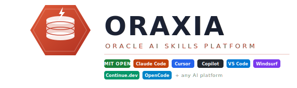

<p align="center">
  
</p>

<p align="center">
  <strong>O</strong>racle · <strong>R</strong>epository for <strong>A</strong>I · <strong>X</strong>-platform · <strong>I</strong>ntelligent <strong>A</strong>ssistance
</p>

<p align="center">
  <a href="https://opensource.org/licenses/MIT"></a>
  <a href="https://www.oracle.com/database/"></a>
  <a href="https://apex.oracle.com"></a>
  <a href="https://claude.ai/code"></a>
  <a href="https://cursor.sh"></a>
  <a href="https://github.com/features/copilot"></a>
  <a href="https://opencode.ai"></a>
</p>

---

**ORAXIA** is an open-source collection of **natural language AI skill definitions** for Oracle Database and Oracle APEX development — designed to work seamlessly across **every major AI coding platform**.

Write less boilerplate. Ship better Oracle code. Let your AI actually know Oracle.

---

## 🌐 Supported AI Platforms

| Platform | Config File | Status |
|---|---|---|
| 🤖 Claude Code | `.claude/CLAUDE.md` | ✅ Ready |
| 🖱️ Cursor | `.cursor/rules/oracle-apex.mdc` | ✅ Ready |
| 🐙 GitHub Copilot / Codex | `.github/copilot-instructions.md` | ✅ Ready |
| 💻 VS Code (AI Extension) | `.vscode/ai-instructions.md` | ✅ Ready |
| 🔓 OpenCode | `opencode.md` | ✅ Ready |
| 🌀 Continue.dev | `.continue/config.json` | ✅ Ready |
| 🏄 Windsurf | `.windsurfrules` | ✅ Ready |

---

## 📚 Skill Categories

```
oraxia/
├── skills/
│   ├── oracle-sql/           # Core SQL, DDL, DML, TCL, DCL, Analytic Functions
│   ├── oracle-plsql/         # PL/SQL, Packages, Triggers, Cursors, Collections
│   ├── oracle-apex/          # Pages, Regions, Dynamic Actions, REST, ORDS
│   ├── oracle-dba/           # Administration, Storage, Users, Tablespaces, RMAN
│   ├── oracle-performance/   # Tuning, Indexes, Execution Plans, AWR, Hints
│   ├── oracle-connection-pooling/ # Pool sizing, exhaustion diagnosis, HikariCP/UCP, hidden dependencies
│   ├── oracle-concurrency/   # Locking, Savepoints, Transactions, Enqueues, MVCC
│   ├── oracle-data-quality/  # Invisible characters, DUMP() diagnostics, exact-match failures
│   ├── oracle-security/      # VPD, RLS, Encryption, Auditing, Wallet
│   ├── oracle-23ai/          # 23ai Features: Boolean, IF NOT EXISTS, Domains, Duality Views, PGQ
│   ├── oracle-vector/        # AI Vector Search: VECTOR type, DBMS_VECTOR, HNSW/IVF, RAG
│   ├── oracle-ords/          # REST Data Services: AutoREST, Modules, OAuth2, UTL_HTTP
│   └── oracle-partitioning/  # Partitioning: Range, List, Hash, Interval, Composite, Exchange
├── platform-configs/         # Ready-to-copy config files per AI platform
└── docs/                     # Extended documentation
```

---

## 🚀 Quick Start

### Option 1 — Clone into your project
```bash
git clone https://github.com/hvrcharon1/oraxia.git .oraxia
```
Then copy the platform config for your AI tool (see `platform-configs/`).

### Option 2 — Use as a Git submodule
```bash
git submodule add https://github.com/hvrcharon1/oraxia.git .oraxia
```

### Option 3 — Use individual skill files
Copy any `SKILL.md` from the `skills/` directory and reference it in your AI platform config.

---

## 🔧 Platform Setup

### Claude Code
```bash
mkdir -p .claude && cp .oraxia/.claude/CLAUDE.md .claude/CLAUDE.md
```

### Cursor
```bash
mkdir -p .cursor/rules && cp .oraxia/.cursor/rules/oracle-apex.mdc .cursor/rules/
```

### GitHub Copilot / Codex
```bash
mkdir -p .github && cp .oraxia/.github/copilot-instructions.md .github/
```

### VS Code
```bash
mkdir -p .vscode && cp .oraxia/.vscode/ai-instructions.md .vscode/
```

### Windsurf
```bash
cp .oraxia/.windsurfrules .windsurfrules
```

---

## 🏛️ Full Skill Coverage

### Oracle Database SQL
- ✅ SELECT, JOINs, Subqueries, CTEs (`WITH` clause)
- ✅ Analytic / Window Functions (`OVER`, `PARTITION BY`, `LAG`, `LEAD`, `RANK`)
- ✅ DDL (CREATE TABLE, INDEX, SEQUENCE, SYNONYM)
- ✅ DML (INSERT, UPDATE, DELETE, MERGE)
- ✅ JSON & XML storage and querying
- ✅ Oracle 19c / 21c / 23ai features (JSON Relational Duality, SQL Domains)
- ✅ CONNECT BY hierarchical queries
- ✅ Pivot / Unpivot
- ✅ Flashback queries

### Oracle PL/SQL
- ✅ Anonymous blocks, Stored procedures, Functions
- ✅ Packages (Specification + Body)
- ✅ Triggers (Row-level, Statement-level, Instead-of)
- ✅ Cursors (Explicit, Implicit, REF CURSOR)
- ✅ Collections (Associative arrays, Nested tables, Varrays)
- ✅ Exception handling
- ✅ Bulk processing (FORALL, BULK COLLECT)
- ✅ DBMS_SCHEDULER, DBMS_OUTPUT, DBMS_PIPE, UTL_FILE, UTL_HTTP

### Oracle APEX
- ✅ Application & Page design patterns
- ✅ Region types: Classic Report, Interactive Report, Interactive Grid, Cards, Maps, Charts
- ✅ Dynamic Actions (JavaScript, PL/SQL, AJAX)
- ✅ Page Processes & Validations
- ✅ REST Data Sources & ORDS integration
- ✅ APEX_* APIs (APEX_JSON, APEX_WEB_SERVICE, APEX_MAIL, etc.)
- ✅ Universal Theme, Template Components, Faceted Search
- ✅ Authorization & Authentication schemes
- ✅ APEX AI / Generative AI integration (APEX 24.1+)
- ✅ Progressive Web App (PWA) configuration

### Oracle DBA & Administration
- ✅ Tablespace & Datafile management
- ✅ User, Role & Privilege management
- ✅ RMAN backup & recovery scripts
- ✅ Data Pump (expdp / impdp)
- ✅ Oracle Multitenant (CDB / PDB)
- ✅ Oracle RAC concepts
- ✅ Oracle Data Guard basics

### Performance Tuning
- ✅ Execution plan analysis (EXPLAIN PLAN, DBMS_XPLAN)
- ✅ Index strategies (B-Tree, Bitmap, Function-based, Composite)
- ✅ SQL hints
- ✅ AWR / ASH reports interpretation
- ✅ Optimizer statistics (DBMS_STATS)
- ✅ Partitioning strategies

### Oracle Connection Pooling 🔌
- ✅ Reading pool accounting numbers (total / active / idle / waiting) before touching config
- ✅ Why oversized pools reduce throughput — CPU/I-O contention, context-switching, cache thrash
- ✅ HikariCP/UCP core-and-I/O sizing heuristic as a starting point, confirmed via load testing
- ✅ Diagnosing the "hidden dependency" pattern — a synchronous external call holding a pooled connection
- ✅ Correlating timeout durations across logs to unmask a masked downstream dependency
- ✅ Oracle session/SQL-view diagnosis of what a held connection is actually doing
- ✅ Layered remediation: sizing, fast-fail timeouts, leak detection, circuit breakers, decoupling connection from network call
- ✅ Idle-connection validation / health-check queries
- ✅ Anti-patterns: reflexive pool enlargement, connections held across network calls, untimed outbound calls

### Oracle Locking & Concurrency 🔒
- ✅ SAVEPOINT / ROLLBACK TO SAVEPOINT semantics (partial-transaction undo)
- ✅ Interested Transaction List (ITL) / Uba row-locking internals
- ✅ Transaction-level wait queues vs. row-level visibility re-evaluation
- ✅ Diagnosing blocking chains (`v$lock`, `v$session`, `x$ktcsp`)
- ✅ Modern (23ai) multi-line `ORA-00001` / `ORA-03301` duplicate-key diagnostics
- ✅ 23ai `CREATE ASSERTION` and AN-enqueue behavior
- ✅ Deadlock-safe retry patterns for unique-constraint contention
- ✅ Anti-patterns: FIFO wait-order assumptions, savepoint-as-lock-release assumptions

### Oracle Data Quality 🔍
- ✅ `DUMP()` — inspecting the raw byte representation behind any column value
- ✅ Diagnosing exact-match failures where rendered text looks identical but the underlying bytes differ
- ✅ Detecting hidden `CHR(13)`/`CHR(10)` (CR/LF) contamination from Excel/Word paste, Windows-style CSV loads, and unsanitized migrations
- ✅ APEX Popup LOV vs. Select List — why one silently blanks and the other renders fine from the same query
- ✅ Permanent cleanup via `TRIM(REPLACE(REPLACE(...)))` instead of a defensive `TRIM()` scattered across every query
- ✅ Recognizing the same failure mode in `WHERE`-clause equality, `UNIQUE` constraints, and joins
- ✅ Anti-patterns: masking with `TRIM()` instead of fixing the data, assuming query tools reveal byte-level contamination

### Security
- ✅ Virtual Private Database (VPD / RLS)
- ✅ Oracle Label Security
- ✅ Transparent Data Encryption (TDE)
- ✅ Unified Auditing
- ✅ Oracle Wallet
- ✅ APEX Access Control

### Oracle 23ai New Features ✨
- ✅ Native `BOOLEAN` SQL column type (no more `NUMBER(1)` workarounds)
- ✅ `IF [NOT] EXISTS` for CREATE / DROP / ALTER — idempotent migration scripts
- ✅ SQL Domains — reusable column constraints and display expressions
- ✅ Table Value Constructors — inline `FROM (VALUES ...)` tables
- ✅ Direct-join UPDATE and DELETE — no correlated subqueries needed
- ✅ JSON Relational Duality Views — JSON API over relational tables, full ACID
- ✅ SQL/PGQ Property Graph Queries — graph queries inside standard SQL
- ✅ Schema-level privilege grants — grant on all objects in a schema at once
- ✅ `DB_DEVELOPER_ROLE` — right-sized privilege bundle for app developers
- ✅ Version compatibility quick reference (23ai vs 21c vs 19c vs 12c)

### Oracle AI Vector Search 🤖
- ✅ `VECTOR(n, FLOAT32|FLOAT64|INT8|BINARY)` column type
- ✅ `DBMS_VECTOR.CREATE_CREDENTIAL` — provider setup (OpenAI, OCI GenAI, Cohere)
- ✅ `DBMS_VECTOR.EMBED_TEXT` — generate embeddings inline in SQL or PL/SQL
- ✅ Distance metrics: `COSINE`, `DOT`, `EUCLIDEAN`, `EUCLIDEAN_SQUARED`
- ✅ Shorthand operators: `<=>` (cosine), `<#>` (dot), `<->` (euclidean)
- ✅ HNSW vector index — in-memory ANN, lowest latency
- ✅ IVF vector index — disk-based ANN, scales to hundreds of millions of rows
- ✅ `FETCH APPROXIMATE FIRST n ROWS ONLY WITH TARGET ACCURACY n` syntax
- ✅ Pre-filter and post-filter patterns for filtered ANN search
- ✅ Full RAG pipeline with `DBMS_VECTOR_CHAIN` (chunk → embed → retrieve → generate)
- ✅ Hybrid Search — blend Oracle Text keyword scores with vector similarity scores

### Oracle REST Data Services (ORDS) 🌐
- ✅ `ORDS.ENABLE_SCHEMA` and `ORDS.ENABLE_OBJECT` — AutoREST in seconds
- ✅ AutoREST endpoints: GET collection, GET item, POST, PUT, PATCH, DELETE
- ✅ Custom REST modules with `ORDS.DEFINE_MODULE` / `ORDS.DEFINE_HANDLER`
- ✅ All source types: `collection_feed`, `collection_item`, `plsql`, `media`, `query`
- ✅ Automatic pagination envelope (`hasMore`, `limit`, `offset`, `links`)
- ✅ Bind variables — URI params, query-string params, JSON body fields
- ✅ Special binds: `:status_code`, `:location`, `:body`, `:body_text`
- ✅ `ORDS.DEFINE_PARAMETER` for OpenAPI 3.0 spec generation
- ✅ OAuth 2.0 — Client Credentials flow with `OAUTH.CREATE_CLIENT`
- ✅ Outbound REST from PL/SQL via `APEX_WEB_SERVICE` and `UTL_HTTP`
- ✅ Metadata inspection queries (`user_ords_modules`, `user_ords_handlers`, etc.)

### Oracle Partitioning 🗂️
- ✅ Range partitioning — time-based, with `MAXVALUE` catch-all
- ✅ Interval partitioning — auto-create monthly, weekly, or daily partitions
- ✅ List partitioning — discrete values (region, status, country)
- ✅ Hash partitioning — even distribution across N power-of-2 partitions
- ✅ Composite partitioning — Range-Hash, Range-List with subpartition templates
- ✅ Reference partitioning — child tables inherit parent partition structure via FK
- ✅ Local vs Global indexes — when to use each, alignment rules
- ✅ Partition management DDL: `ADD`, `DROP`, `TRUNCATE`, `SPLIT`, `MERGE`, `MOVE`
- ✅ `UPDATE GLOBAL INDEXES` — keeping global indexes valid during partition DDL
- ✅ Partition Exchange — O(1) bulk load via staging table swap
- ✅ Partition pruning — how to verify with `DBMS_XPLAN` `PARTITION` format
- ✅ Partition metadata queries (`user_tab_partitions`, `user_part_indexes`, etc.)

---

## 🤝 Contributing

We welcome contributions! Please see [CONTRIBUTING.md](CONTRIBUTING.md) for guidelines.

1. Fork the repository
2. Create your skill branch: `git checkout -b skill/oracle-23ai-json-duality`
3. Commit your changes: `git commit -m 'feat: Add Oracle 23ai JSON Relational Duality views skill'`
4. Push and open a Pull Request

---

## 📄 License

[MIT License](LICENSE) — free to use in any project.

---

<p align="center"><em>Built with ❤️ for the Oracle developer community · Works on every AI platform</em></p>
